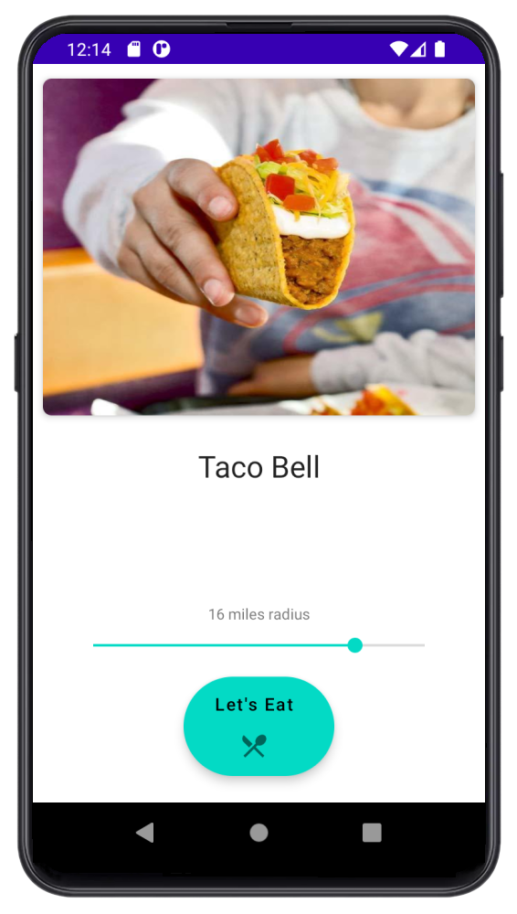

# Let's Eat

An easier way to find food using an Android app.

Deciding on what to eat for lunch may be difficult,
especially with so many options to choose from. This
app recommends a nearby food location at the click of a
button.

## Technologies
- Kotlin
- Architecture
  - MVVM (Model - View - ViewModel)
  - Repository pattern
- [Google Play services](https://developers.google.com/android/guides/overview) -
find the user's location
- [Retrofit](https://square.github.io/retrofit/) -
construct REST API calls to [Google Places API](https://developers.google.com/maps/documentation/places/web-service/search)
- [Picasso](https://square.github.io/picasso/) -
load images
- [Coroutines](https://github.com/Kotlin/kotlinx.coroutines) -
return values from callback
